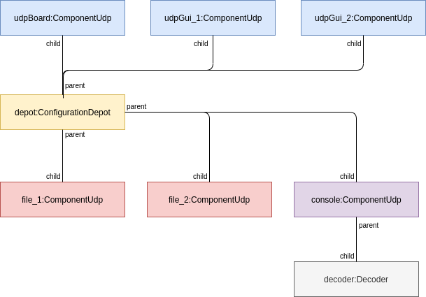

# 1. DiagnosticDaemon

## 1.1. Introduction

The DiagnosticDaemon application has been developed to get diagnostic messages from the RTOS boards, from yarprobotinterface and from any other udp source and redirect them to other applications or write the messages to file or console.

<figure style="display:block;margin-left:auto;margin-right:auto;width:80%">
    
    <figcaption><b>Deploy diagram</b></figcaption>
</figure>


## 1.2. Installation from source on Linux system

Prerequisite:

```bash
sudo apt-get install build-essential g++ cmake libboost-system-dev
```
Clone the DiagnosticDaemon repository:

```bash
git clone https://github.com/icub-tech-iit/diagnostic-daemon.git
```

Clone the icub-firmware-shared repository
```bash
git clone https://github.com/icub-tech-iit/icub-firmware-shared.git
```

Clone the icub-firmware repository
```bash
git clone https://github.com/icub-tech-iit/icub-firmware.git
```
**<i>Temporary agreement</i>**: note that the DiagnosticDaemon,icub-firmware-shared and icub-firmware
repository must be at the same level.

Compile:
```bash
cd DiagnosticDaemon
mkdir build
cd build
cmake ..
make
make rebuild_cache
```

## 1.3. Installation from source on Windows system

Not available for now.

## 1.4. Execution

To execute the application:
```bash
cd DiagnosticDaemon/build/bin
./diagnosticdaemon
```

## 1.5. Default configuration

The DiagnosticDaemon has a configuration file in xml called config.xml.
The file must be located in the same folder of the diagnosticdaemon executable file.
Here is the default file:

```xml
<configuration>
    <component protocol="udp-broadcast"  name="boards"     rxport="11000" txport="11000" address="10.0.1.1"   mask="255.255.255.0" mode="copy-raw"    addressfilter="x:10.0.1.4 i:10.0.1.1" enable="true"  value="" destination="file file2 console gui gui2"/>  
    <component protocol="udp"            name="gui"        rxport="8000"  txport="9000"  address="127.0.0.1"  mask=""              mode="copy-raw"    addressfilter="" enable="false"  value="" destination="boards"/>
    <component protocol="udp"            name="gui2"       rxport="8001"  txport="9001"  address="127.0.0.1"  mask=""              mode="copy-raw"    addressfilter="" enable="false"  value="" destination="boards"/>
    <component protocol="file"           name="file"       rxport=""      txport=""      address=""           mask=""              mode="copy-parser" addressfilter="" enable="true"  value="logger.log" destination=""/>
    <component protocol="file"           name="file2"      rxport=""      txport=""      address=""           mask=""              mode="copy-parser" addressfilter="" enable="true"  value="logger2.log" destination=""/>
    <component protocol="console"        name="console"    rxport=""      txport=""      address=""           mask=""              mode="copy-parser" addressfilter="" enable="true"  value="" destination="boards"/>
</configuration>

```
At the start the DiagnosticDaemon reads the file and create as many components as described in the
config.xml file. In this case the following UML diagram describe the created objects:

<figure style="display:block;margin-left:auto;margin-right:auto;width:80%;border:solid 1px">
    
    <figcaption><i>UML Object diagram</i></figcaption>
</figure>

The message flow through the instantiated components:

<figure style="display:block;margin-left:auto;margin-right:auto;width:80%;border:solid 1px">
    
    <figcaption><i>UML msg diagram</i></figcaption>
</figure>
In the figure the message flow from RTOS and yarprobotinterface to the file/console/gui.

## 1.6. Tags meaning

A component in the config.xml:

```xml
<component protocol="udp-broadcast"  name="boards"     rxport="11000" txport="11000" address="10.0.1.1"   mask="255.255.255.0" mode="copy-raw"    filter="all" enable="true"  value="" destination="file file2 console gui gui2"/>
```

The component tag has the following attributes:

| parameter name | parameter value | note |
|---------|--------|--------|
|protocol|udp/file/console|component type|
|name|| component name|
|rxport||rx ip port|
|txport||tx ip port|
|address||ip destination address|
|mask|||
|mode|||
|filter|x:1.1.1.1|excluded messages from this addresses|
|enable|true/false|enable or disable the component|
|value|||
|destination||destination components name|


## 1.6. Application structure

In figure the application class diagram.

<figure style="display:block;margin-left:auto;margin-right:auto;width:80%;border:solid 1px">
    
    <figcaption><i>UML class diagram</i></figcaption>
</figure>
